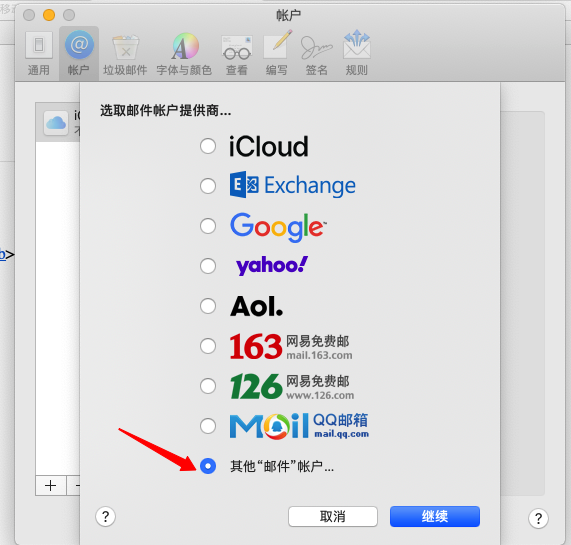

 # 使用 Docker Compose 5分钟 部署 一台邮件服务器

 # 背景

> 由于 `Gmail` 邮箱在国内无法使用 且 `国内手机` 号码无法继续注册账号原因，最近想着折腾一下 自建一台 `邮件服务器` 玩玩。正好在国外有台 vps (搬瓦工的)，比较空闲，目前且用来做扶墙使用，有点浪费，决定使用此台服务器搭建 `邮件服务器` 。选择的部署方案选择了较为轻便的 `docker`，在了解网上主流的实现镜像后 `analogic/poste.io` & `mailserver/docker-mailserver`，由于目前 vps 资源为 `2c 1g` 的低配置，试着跑了一下前者，资源占用非常大(可能 默认开了什么功能什么的)，当前配置下完全跑不动。了解后者这个 [项目](https://github.com/docker-mailserver/docker-mailserver/) 后，可以在最低 `1c 512m` 下运行，决定选用后者 `docker-mailserver` 作为部署。

 ## 环境说明

  - Email 服务器: `23.105.194.216 `(搬瓦工 vps)
  - 使用容器镜像: `mailserver/docker-mailserver:latest`
  - 系统版本: `CentOS Linux release 7.9.2009 (Core)`
  - 内核版本: `4.14.129-bbrplus`
  - Docker Version: `20.10.7`
  - Docker Compose Version: `1.29.2`
  - ÷DNS 服务商: `aliyun`

 ## 基础介绍

 ### 常见邮件服务端口 & 协议 介绍

> 详细介绍信息， 查看[此文档](https://docker-mailserver.github.io/docker-mailserver/edge/config/security/understanding-the-ports/)

 | 协议     | 端口       |
 | -------- | ---------- |
 | **SMTP** | 25/587/465 |
 | **IMAP** | 143/993    |
 | POP3     | 110/995    |

 ### 常见 邮件软件 和 安全软件 介绍

 | 软件名称     | 简介                                                         |
 | ------------ | ------------------------------------------------------------ |
 | sendmail     | 用于发邮件。资格最老的邮局，所有Linux发行版基本都带。但是配置麻烦。 |
 | **postfix**  | [Wietse Venema](http://www.postfix.org/) 觉得 sendmail 配置太麻烦了，就开发了一个 “简化配置版 sendmail”，即postfix。支持smtp协议。 |
 | **dovecot**  | 用于收邮件，支持imap/pop3。                                  |
 | spamassasin  | 垃圾邮件过滤器。可以自订规则。                               |
 | clamav       | 邮件杀毒工具。                                               |
 | **opendkim** | 生成dkim签名。有什么用？详见下面的“反垃圾邮件技术”。         |
 | fail2ban     | 防止别人暴力破解用户名密码的工具。                           |

 ### 反垃圾邮件技术 介绍

 假设我要在1.1.1.2这台机器上配置 best.pm、best.nl 这两个域名用于发邮件。1.1.1.2 的主机名是 mail1.wangchenyu.net.cn。那么我们需要

 - **设置 rDNS，将 1.1.1.2 映射到 mail1.wangchenyu.net.cn**。DNS是域名 -> IP的解析。rDNS 即I P-> 域名的解析。有了这个rDNS记录，收到邮件的服务器就能确认 mail1.wangchenyu.net.cn 可以被用在1.1.1.2这个IP上。一般在主机商后台可以添加 rdns 记录，找不到的话提交一个工单即可。
 - **设置 best.pm 和 best.nl 的MX记录，记录名为 @，值为 mail1.wangchenyu.net.cn，优先级为10。\**MX记录用于别人向best.pm这个域发送邮件时查找\**收信服务器**。不设置的话无法收到别人发的邮件，并且自己发出的邮件的“可信度”也会大大降低。优先级
 - **设置DKIM签名。DKIM先由发件服务器生成**，之后每封邮件都会带上这个签名。接着，**还要在 best.pm 和 best.nl 上各添加一条TXT记录**，记录名和值**在发件服务器生成DKIM时都会提供**。收到邮件后会对比邮件中的DKIM签名和DNS中的TXT记录是否一致
 - **设置SPF记录** 这个记录规定了可以用这个域发邮件的主机。**在 best.pm 和 best.nl 上各添加一条TXT记录，**记录名为`@`，值为`v=spf1 mx ~all`即可允许所有IP使用此域。
 - **设置DMARC记录** 这个记录指出他们的地址被 SPF 和/或 DKIM/或别的方法保护。**在 best.pm 和 best.nl 上各添加一条TXT记录，**记录名为`_dmarc`，值为`v=DMARC1; p=none`

 # 安装部署

> 这里安装部署我们使用 `Docker Compose`，使用较低版本还不行，建议是按照下面的步骤 `安装最新` 的版本，如你已安装和配置，对下面部分配置做跳过即可。

 ## 安装前准备工作

 - 安装 docker

   ```bash
   curl -fsSL https://get.docker.com -o get-docker.sh  # 使用脚本安装
   sudo sh get-docker.sh
               
   cat > /etc/docker/daemon.json << EOF `# 配置优化`
   {
       "oom-score-adjust": -1000,
       "log-driver": "json-file",
       "log-opts": {
       "max-size": "100m",
       "max-file": "3"
       },
       "max-concurrent-downloads": 10,
       "exec-opts": ["native.cgroupdriver=systemd"],
       "max-concurrent-uploads": 10,
       "storage-driver": "overlay2",
       "storage-opts": [
       "overlay2.override_kernel_check=true"
       ]
   }
   EOF
               
   systemctl start docker \  `# 启动 并设置开机自启`
   && systemctl enable docker \
   && systemctl status docker
   ```

   

 - 安装 docker-compose

   ```bash
   curl -L "https://github.com/docker/compose/releases/download/1.29.2/docker-compose-$(uname -s)-$(uname -m)" -o /usr/local/bin/docker-compose \
   && chmod +x /usr/local/bin/docker-compose \
   && ln -s /usr/local/bin/docker-compose /usr/bin/docker-compose \
   && docker-compose --version
   ```

   

 - 阿里云设置 DNS 记录

   > 这里 设置的 DNS 未包含 `DKIM` 签名记录。这个记录需要在后面，使用脚本进行生成。

   | DNS 类型 | 记录名 | 记录值                                                       | TTL     |
   | -------- | ------ | ------------------------------------------------------------ | ------- |
   | A        | mail   | 23.105.194.216                                               | 30 分钟 |
   | MX       | @      | mail.treesir.pub \|10 (优先级 10)                            | 30 分钟 |
   | TXT      | @      | v=spf1 mx ~all                                               | 30 分钟 |
   | TXT      | _dmarc | v=DMARC1; p=quarantine; rua=mailto:dmarc.report@treesir.pub; ruf=mailto:dmarc.report@treesir.pub; fo=0; adkim=r; aspf=r; pct=100; rf=afrf; ri=86400; sp=quarantine | 30 分钟 |

   > 表中 `treesir.pub` 注意替换为你自己的 主域名。

 - VPS 服务器设置 反向解析 `PTR` (rdns) 记录

   [](https://cdn.treesir.pub/img/image-20210803123544465.png)

 - 使用 `certbot` 生成 `letsencrypt` 证书

   ```bash
   yum install -y certbot
               
   certbot certonly --manual --preferred-challenge dns -d  mail.treesir.pub # `此 命令会生成 一条 TXT 记录记录用于验证`
   ```

   

   [](https://cdn.treesir.pub/img/image-20210803140906174.png)

   > 将生成的 TXT 记录添加至 DNS 解析，添加后 使用 `dig` 进行检查解析是否生效后。`生效` 没有问题后 `回车` 继续。注意此条记录 `不要删除`，后续 `续签证书`时 还需要用到，正常情况下会在 `/etc/letsencrypt/archive/xxx/` 下生成对应域名的证书。
   >
   > ```bash
   > yum install bind-utils `# 安装 dig 命令`
   > 
   > dig TXT _acme-challenge.mail.treesir.pub `# 检查 解析`
   > ```
   >
   > 
   >
   > [](https://cdn.treesir.pub/img/image-20210803141426633.png)

   **配置定时续签证书**

   > 注意添加 crontab 定时任务时，检查一下 `crond` 服务器 是否有在正常运行。

   ```bash
   crontab -e  `# 打开 crontab 配置文件`
   
   0 5 * * 1 /usr/bin/certbot renew --quiet
   
   service crond status `# 检查服务是否正常运行`
   ```

   

 ## 部署 `docker-mailserver` 容器镜像

 ### clone 仓库地址

 ```bash
 git clone https://github.com/docker-mailserver/docker-mailserver.git
 ```

 

 ### 更改后的配置展示

 `docker-compose.yml` 文件

 ```bash
 version: '3.8'
 
 services:
   mailserver:
     image: docker.io/mailserver/docker-mailserver:latest
     hostname: mail
     domainname: treesir.pub
     container_name: mailserver
     env_file: mailserver.env
     dns: 223.5.5.5
     ports:
       - "25:25"
       - "143:143"
       - "587:587"
       - "993:993"
       - "110:110"
       - "995:995"
     volumes:
       - ./data/maildata:/var/mail
       - ./data/mailstate:/var/mail-state
       - ./data/maillogs:/var/log/mail
       - /etc/localtime:/etc/localtime:ro
       - ./config/:/tmp/docker-mailserver
       - /etc/letsencrypt/archive/mail.treesir.pub:/tmp/ssl:ro
     restart: always
     stop_grace_period: 1m
     cap_add: [ "NET_ADMIN", "SYS_PTRACE" ]
 ```

 

 `mailserver.env` 文件

 > 这里由于文件较长，不方便演示，且打印未注释的代码段

 ```bash
 cat mailserver.env |egrep -v '^$|^#'
 
 OVERRIDE_HOSTNAME=
 DMS_DEBUG=1
 SUPERVISOR_LOGLEVEL=
 ONE_DIR=1
 POSTMASTER_ADDRESS=yangzun@treesir.pub
 ENABLE_UPDATE_CHECK=1
 UPDATE_CHECK_INTERVAL=1d
 PERMIT_DOCKER=network
 NETWORK_INTERFACE=
 TLS_LEVEL=
 SPOOF_PROTECTION=
 ENABLE_SRS=0
 ENABLE_POP3=1
 ENABLE_CLAMAV=0
 ENABLE_AMAVIS=1
 AMAVIS_LOGLEVEL=0
 ENABLE_FAIL2BAN=0
 FAIL2BAN_BLOCKTYPE=drop
 ENABLE_MANAGESIEVE=
 POSTSCREEN_ACTION=enforce
 SMTP_ONLY=
 SSL_TYPE=manual
 SSL_CERT_PATH=/tmp/ssl/fullchain1.pem
 SSL_KEY_PATH=/tmp/ssl/privkey1.pem
 SSL_ALT_CERT_PATH=
 SSL_ALT_KEY_PATH=
 VIRUSMAILS_DELETE_DELAY=
 ENABLE_POSTFIX_VIRTUAL_TRANSPORT=
 POSTFIX_DAGENT=
 POSTFIX_MAILBOX_SIZE_LIMIT=102400000
 ENABLE_QUOTAS=1
 POSTFIX_MESSAGE_SIZE_LIMIT=102400000
 PFLOGSUMM_TRIGGER=
 PFLOGSUMM_RECIPIENT=
 PFLOGSUMM_SENDER=
 LOGWATCH_INTERVAL=
 LOGWATCH_RECIPIENT=
 REPORT_RECIPIENT=0
 REPORT_SENDER=
 REPORT_INTERVAL=daily
 POSTFIX_INET_PROTOCOLS=all
 ENABLE_SPAMASSASSIN=0
 SPAMASSASSIN_SPAM_TO_INBOX=1
 MOVE_SPAM_TO_JUNK=1
 SA_TAG=2.0
 SA_TAG2=6.31
 SA_KILL=6.31
 SA_SPAM_SUBJECT=***SPAM*****
 ENABLE_FETCHMAIL=0
 FETCHMAIL_POLL=300
 ENABLE_LDAP=
 LDAP_START_TLS=
 LDAP_SERVER_HOST=
 LDAP_SEARCH_BASE=
 LDAP_BIND_DN=
 LDAP_BIND_PW=
 LDAP_QUERY_FILTER_USER=
 LDAP_QUERY_FILTER_GROUP=
 LDAP_QUERY_FILTER_ALIAS=
 LDAP_QUERY_FILTER_DOMAIN=
 DOVECOT_TLS=
 DOVECOT_USER_FILTER=
 DOVECOT_PASS_FILTER=
 DOVECOT_MAILBOX_FORMAT=maildir
 DOVECOT_AUTH_BIND=
 ENABLE_POSTGREY=0
 POSTGREY_DELAY=300
 POSTGREY_MAX_AGE=35
 POSTGREY_TEXT=Delayed by Postgrey
 POSTGREY_AUTO_WHITELIST_CLIENTS=5
 ENABLE_SASLAUTHD=0
 SASLAUTHD_MECHANISMS=
 SASLAUTHD_MECH_OPTIONS=
 SASLAUTHD_LDAP_SERVER=
 SASLAUTHD_LDAP_BIND_DN=
 SASLAUTHD_LDAP_PASSWORD=
 SASLAUTHD_LDAP_SEARCH_BASE=
 SASLAUTHD_LDAP_FILTER=
 SASLAUTHD_LDAP_START_TLS=
 SASLAUTHD_LDAP_TLS_CHECK_PEER=
 SASLAUTHD_LDAP_TLS_CACERT_FILE=
 SASLAUTHD_LDAP_TLS_CACERT_DIR=
 SASLAUTHD_LDAP_PASSWORD_ATTR=
 SASL_PASSWD=
 SASLAUTHD_LDAP_AUTH_METHOD=
 SASLAUTHD_LDAP_MECH=
 SRS_SENDER_CLASSES=envelope_sender
 SRS_EXCLUDE_DOMAINS=
 SRS_SECRET=
 DEFAULT_RELAY_HOST=
 RELAY_HOST=
 RELAY_PORT=25
 RELAY_USER=
 RELAY_PASSWORD=
 ```

 

 > 上面的 配置含义说明，请参考 [此文档](https://docker-mailserver.github.io/docker-mailserver/edge/config/environment/)

 ## 启动容器 & 后续配置工作

 ```bash
 docker-compose up -d `# 启动容器`
 
 docker-compose logs -f `# 观察容器 相关日志`
 ```

 

 ### 添加 email user

 > 服务器在公网，这里就不要使用 `弱密码`了，防止 hacker 进行 暴力破解。

 ```bash
 ./setup.sh email add yangzun@treesir.pub "xxx" `# 添加 邮件账号及密码`
 
 ./setup.sh email update yangzun@treesir.pub "xxx" `# 更新 邮件账号及密码`
 ```

 

 ### 生成 `DKIM` 签名记录

 > 注意下面的配置中，设置了 `keysize` 参数。原因是默认使用的 keysize 大小为 `4096` ，在 `aliyun`中 无法进行正常的添加。

 ```bash
 ./setup.sh config dkim keysize 2048
 
 cat config/opendkim/keys/treesir.pub/mail.txt  `# 查看 DKIM 签名记录`
 mail._domainkey IN      TXT     ( "v=DKIM1; h=sha256; k=rsa; "
           "p=MIIBIjANBgkqhkiG9w0BAQEFAAOCAQ8AMIIBCgKCAQEA0ojqOcyeDlOn6TcpXCsU92xul6d54wlx/UwPTuE0aywFc+ihyKGAm9D8nmroneN7gf82qTtDbJiHghzRlf6JdpR3kM4ipWKaNRSlUL/64HQqrMeEWx5ErpcgwrXxKWI/rcQ7Rjg2BliP6ayJiEflH0FOtxfgLHnYEcSKupmCV8znM4rZ/LHx9RDwc7o8jWujey6h9zrYPXyqim"
           "obGSB0PZGNQhe7mWRefMraFGgnNq+PrtEnmaOFxH2rG1Qh2hhMkeqJsH56yx9f1mxWYTX7r9FtvweGRb+GJNfi6a4vpDrTCffxx6XvGrq032i7VqHpmiaUUuM3j2x1DwHrIbpWTQIDAQAB" )  ; ----- DKIM key mail for treesir.pub
 ```

 

 [](https://cdn.treesir.pub/img/image-20210803143040167.png)

 > 注意生成的记录，需要进行合并起来 才能使用。

 [](https://cdn.treesir.pub/img/image-20210803143222296.png)

 ### 添加 DKIM 记录值至 aliyun

 | DNS 类型 | 记录名          | 记录值                                                       | TTL     |
 | -------- | --------------- | ------------------------------------------------------------ | ------- |
 | TXT      | mail._domainkey | v=DKIM1; h=sha256; k=rsa; p=MIIBIjANBgkqhkiG9w0BAQEFAAOCAQ8AMIIBCgKCAQEA0ojqOcyeDlOn6TcpXCsU92xul6d54wlx/UwPTuE0aywFc+ihyKGAm9D8nmroneN7gf82qTtDbJiHghzRlf6JdpR3kM4ipWKaNRSlUL/64HQqrMeEWx5ErpcgwrXxKWI/rcQ7Rjg2BliP6ayJiEflH0FOtxfgLHnYEcSKupmCV8znM4rZ/LHx9RDwc7o8jWujey6h9zrYPXyqimobGSB0PZGNQhe7mWRefMraFGgnNq+PrtEnmaOFxH2rG1Qh2hhMkeqJsH56yx9f1mxWYTX7r9FtvweGRb+GJNfi6a4vpDrTCffxx6XvGrq032i7VqHpmiaUUuM3j2x1DwHrIbpWTQIDAQAB | 30 分钟 |

 [](https://cdn.treesir.pub/img/image-20210803143453332.png)

 # 验证测试

 > 测试的平台为 `MacOS` & `Windows` 两个平台 ，由于先前测试使用的工具为 `Foxmail` 会出现无法发送邮件问题 ，所以这里 MacOS 中使用的 邮件工具为 自带应用 `Mail` ，Windows 邮件工具使用 `eM Clien`。

 ## 证书验证测试

 > 在进行邮件测试前，可以使用 [此链接](https://www.checktls.com/) 中的工具，测试 是否支持 `tls` 验证。

 [](https://cdn.treesir.pub/img/image-20210803144655191.png)

 [](https://cdn.treesir.pub/img/image-20210803145009819.png)

 ## MacOS & Windows 添加邮件记录

 - macos

   [](https://cdn.treesir.pub/img/image-20210803145301936.png) [](https://cdn.treesir.pub/img/image-20210803145510252.png)

 - window

   > `eM Clien` 工具会自动为我们配置 `IMAP` & `SMTP` 地址信息。

   [](https://cdn.treesir.pub/img/image-20210803150203282.png) [](https://cdn.treesir.pub/img/image-20210803150231988.png)

   [](https://cdn.treesir.pub/img/image-20210803150531520.png) [](https://cdn.treesir.pub/img/image-20210803150604468.png)

 ## 测试邮件发送

 - **Windows to MacOS**

   [](https://cdn.treesir.pub/img/image-20210803151017304.png) [](https://cdn.treesir.pub/img/image-20210803151050244.png)

   `正常收到邮件了`

 - **Macos to Windows**

   `回复一个邮件 进行测试`

   [](https://cdn.treesir.pub/img/image-20210803151529428.png) [](https://cdn.treesir.pub/img/image-20210803151625536.png)

   `测试 邮件收发 一切正常。`

 - **Send to Gmail**

   `测试发送邮件至 Gmail`

   [](https://cdn.treesir.pub/img/image-20210803152341683.png)

   > 正常收到邮件

 # 参考文档

 - https://www.itmanbu.com/docker-mail-server.html
 - https://wiki.dovecot.org/TestInstallation
 - https://docker-mailserver.github.io/docker-mailserver/edge/

 # 总结

 > 一开始使用的 工具是 `Foxmail` 工具进行测试，卡在无法发送邮件这里，以为是自己的证书配置出错了，经过一系类的折腾、排错，花了一天左右的时间总算是搭建出来了。看到其相关文档，好像还可以与 `LDAP` 进行集成，这就不错了，有时间 继续研究一下。